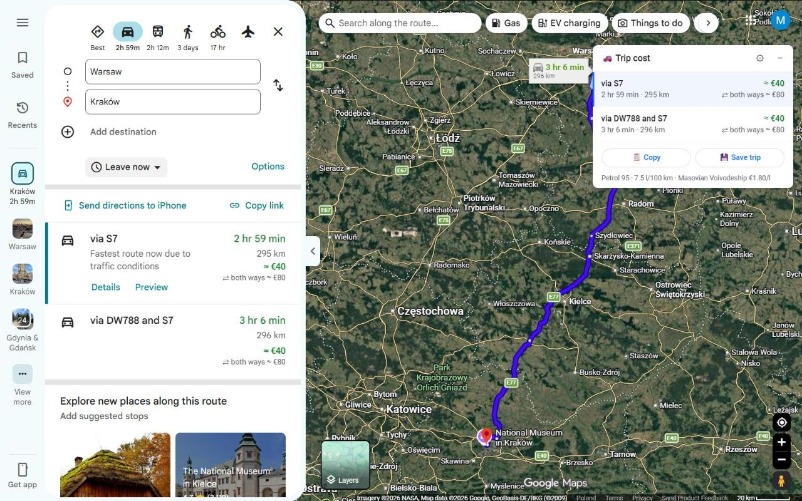
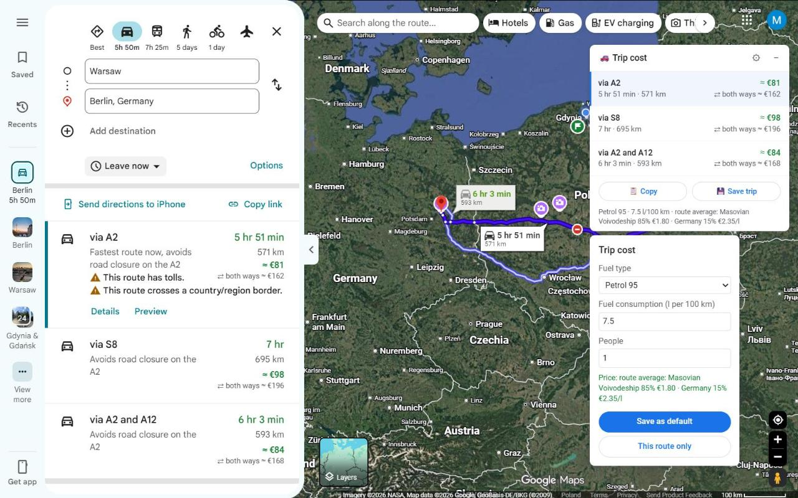
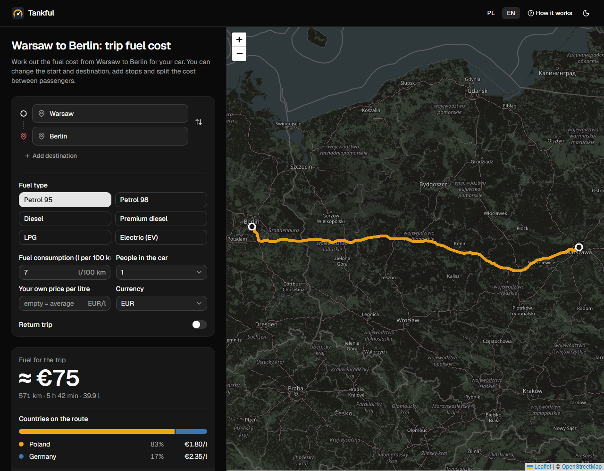

<p align="center">
  
</p>

<h1 align="center">Tankful</h1>

<p align="center">
  <strong>The fuel cost of every driving route, right in Google Maps.</strong><br />
  Live fuel prices for Poland and the EU, trips through several countries, electric cars and cost per person.
</p>

<p align="center">
  <a href="https://chromewebstore.google.com/detail/fiogjemolijaleckapbcngibelfbpfgp"><strong>Add to Chrome</strong></a>
  ·
  <a href="https://michalskii.github.io/tankful/en?ref=github"><strong>Online calculator</strong></a>
  ·
  <a href="https://michalskii.github.io/tankful/?ref=github">Kalkulator po polsku</a>
  ·
  <a href="https://michalskii.github.io/tankful/privacy.html">Privacy</a>
</p>



## What it does

Tankful is a Chrome extension that adds the estimated fuel cost next to the time and distance of every driving route in Google Maps – no copying numbers into a calculator.

- **Every route option** gets its cost in the route list and in the route details, and a small panel on the map compares them side by side.
- **Live fuel prices.** National averages from the European Commission's Weekly Oil Bulletin for Poland and other EU countries; in Poland adjusted when Orlen wholesale prices move significantly.
- **Trips through several countries** – the price is weighted by the kilometres driven in each EU country.
- **Petrol 95 and 98, diesel, premium diesel, LPG** – or your own price. **Electric cars** get a range from charging at home to fast chargers.
- **Round trip and cost per person**, e.g. "4 × PLN 51" when four people share the ride.
- **Trip history** grouped by month, **CSV export** and the Polish mileage allowance (*kilometrówka*) for business trips.
- 12 currencies converted at National Bank of Poland rates, English and Polish interface.



## Online calculator

No Chrome, or on your phone? The same calculation works on the website: pick a start and destination, add stops, choose the fuel and the number of people, and share the result as a link.

**[michalskii.github.io/tankful](https://michalskii.github.io/tankful/en?ref=github)** – with ready pages for popular routes, such as [Warsaw to Berlin](https://michalskii.github.io/tankful/route/warsaw-berlin) or [Kraków to Split](https://michalskii.github.io/tankful/route/krakow-split).



## Privacy

No account, no ads and no analytics in the extension. Settings and trip history stay in your browser. To pick country prices, only the start and destination of a route – rounded to about 1 km – are sent to OpenStreetMap Nominatim, and you can turn that off. Fuel prices come from a public price file on the website, built every few hours from the sources above. Details: [privacy policy](https://michalskii.github.io/tankful/privacy.html).

Costs are estimates based on average prices and the consumption you enter – prices at the pump vary.

## Development

Plain JavaScript, Manifest V3, no build step for the extension. Node.js 22 for the tools and the website.

```sh
node tests/test.js                       # tests
node tools/pack.js                       # extension package → dist/tankful-<version>.zip
node tools/fetch-prices.js prices.json   # download current prices from the sources
node tools/build-site.js prices.json     # website → _site/ (needs Chrome for prerendering)
node tools/fetch-routes.js               # recompute popular routes (OSRM) → site/src/lib/routes.json
```

To try the extension from source, open `chrome://extensions`, turn on *Developer mode*, click *Load unpacked* and pick this folder.

| Path | What's there |
|---|---|
| `manifest.json`, `background.js` | extension manifest; service worker with price downloads and country lookup |
| `content.js`, `dom.js`, `content.css` | Google Maps integration: reading routes and showing costs |
| `settings.js`, `borders.js` | settings, price logic and currencies; EU borders for costing trips by country |
| `popup.*`, `history.*`, `welcome.*` | toolbar popup, trip history, welcome page |
| `_locales/` | English and Polish texts |
| `site/` | the online calculator (React, Vite, Tailwind, shadcn/ui) |
| `tools/`, `tests/` | build, packaging and price scripts; tests |
| `docs/privacy.html` | privacy policy |

The website is deployed to GitHub Pages by `.github/workflows/site.yml` on every push and every 6 hours, which also refreshes `prices.json`.

## Po polsku

Tankful to darmowa wtyczka do Chrome, która pokazuje koszt paliwa przy każdej trasie samochodowej w Mapach Google: po aktualnych średnich cenach z biuletynu Komisji Europejskiej (Polska i kraje UE), także na trasach przez kilka krajów, dla aut elektrycznych, tam i z powrotem i na osobę. Do tego historia przejazdów, eksport do CSV i kilometrówka.

[Dodaj do Chrome](https://chromewebstore.google.com/detail/fiogjemolijaleckapbcngibelfbpfgp) · [Kalkulator online](https://michalskii.github.io/tankful/?ref=github) · [Popularne trasy, np. Warszawa – Kraków](https://michalskii.github.io/tankful/trasa/warszawa-krakow)

## License

[MIT](LICENSE). Tankful is an independent project and is not affiliated with or endorsed by Google.
